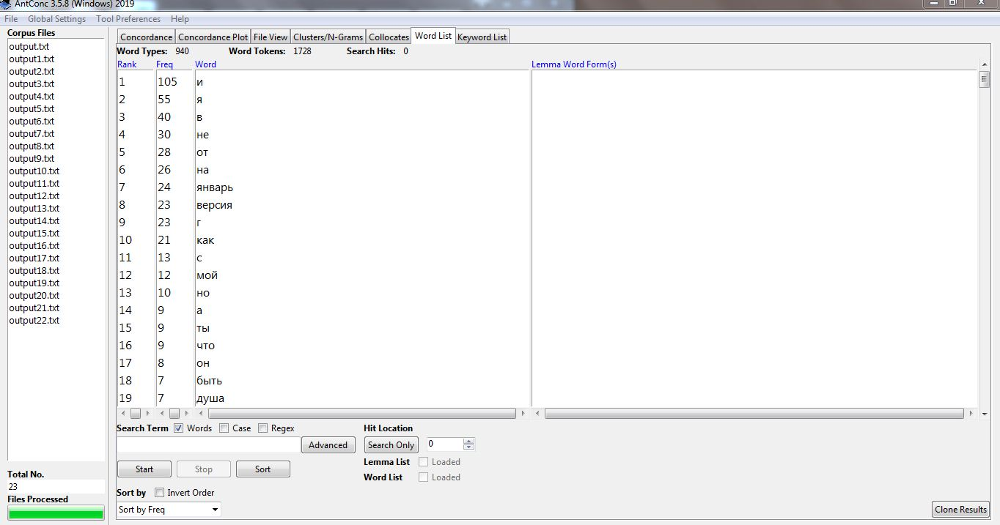
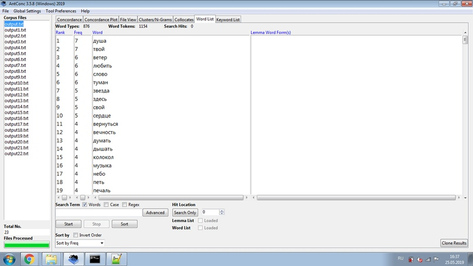
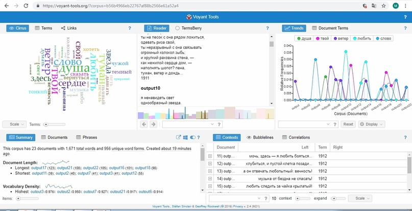
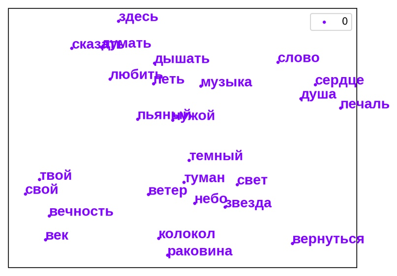
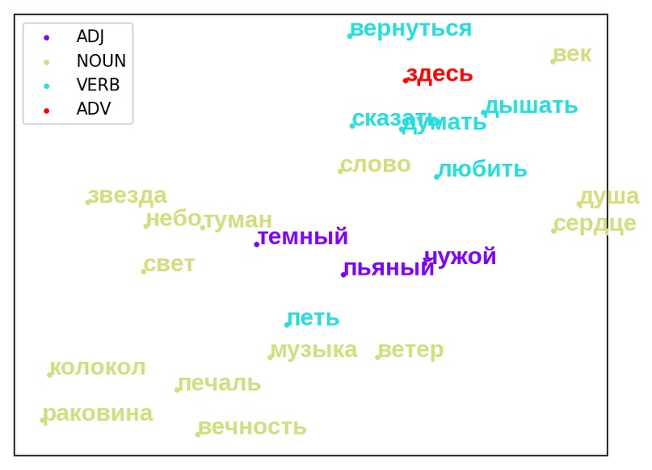

# project
Команда "DreamTeam@
Исследовательницы: Лтитовская Мария, Туникова Мария, Цурик Софья

Тема: Анализ ключевых мотивов сборника стихов Мандельштама "Камень" (1913 г.)

Цель нашего проекта: выявить устойчивый набор мотивов и тем, присутствующих в сборнике Мандельштама.

Для достижения поставленной цель были использованы следующие программы:
Воспользовавшись Bootcat , мы создали корпус стихотворений, вошедших в первое издание "Камня". Далее с помощью программы Mystem подготовили данные для корпуса: произвели процесс лемматизация, то есть образования первоначальной формы слова, исходя из других его словоформ. Лемматизировпнный текст использовали в Antconc, где мы составили список наиболее часто употребляемых слов для последующего анализа, исключив при этом стоп-слова. 

На данном этапе были видны наиболее устойчивые мотивы (например, слова "душа","дышать", "твой", "любить" и т.д.) однако мы решили визуализировать полученные результаты в Voyant.Tools, сравнив при этом работ двух программ. В Voyant.Tools мы также использовали список стоп-слов. Мы убедились в том, что обе программы показали схожие результаты, что позволило нам продолжить работу над следующим этапом.

Программа Rusvectores помогла нам разбить ключевые слова по семантическим группам, что наглядно демонстрирует основные направления тем в сборнике. Мы увидели цепочки взаимосвязанных мотивов, объединенных поэтом в стихотворениях.

В мотиве дыхания («дышать») сочетаются ключевые темы поэзии Мандельштама – жизнь и творчество, как ее неотъемлемая часть. Мотив музыки связан с любовной тематикой, которая, в свою очередь, вновь возвращает нас к теме поэзии, творчества. Присутствует и мотив «слова», призванного заполнить пустоту, и оно неразрывно с процессом дыхания и с творчеством. Звезды, образ, как правило, чего-то недостижимого, небесного в поэзии Мандельштама становятся близкими и даже домашними. Все вместе эти мотивы образуют паутину смыслов, структурный план, что и ассоциируется с акмеизмом.

Итак, формальный метод работы с художественными текстами наглядно продемонстрировал устойчивые мотивы в сборнике О. Э. Мандельштама "Камень" (1913г.) и их семантическую взаимосвязь.
